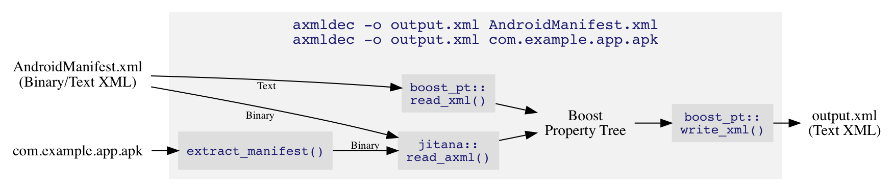

`axmldec`: Android Binary XML Decoder
=====================================

## 1 Overview

`AndroidManifest.xml` in an APK file can be binary encoded. This tool accepts
either a binary or a text XML file and prints the decoded XML to the standard
output or a file.

Tools such as [Apktool] are designed to process the whole APK file including
the resource files for reverse engineering purpose. They may also need a Java
virtual machine to run. As a result, they are too slow for batch processing
many APK files just to get the XML information. In contrast, `axmldec` is
specialized for binary XML decoding and written in simple modern C++, so it
runs nicely within a shell script.

The [parser](include/jitana/util/axml_parser.hpp) is taken from [Jitana], a
graph-based static-dynamic hybrid DEX code analysis tool. You can use
`jitana::read_axml()` instead of the standard
`boost::property_tree::read_xml()` to read a binary XML file into
`boost::property_tree::ptree` ([Boost Property Tree][ptree]) in your C++
program.

## 2 Installation

### 2.1 macOS

You can install `axmldec` using [Homebrew]:

    brew tap ytsutano/toolbox
    brew install axmldec

Or, download the binary from [Releases].

### 2.2 Windows

Download the .exe file from [Releases].

### 2.3 Linux

Build the tool from the source code (see below).

## 3 Usage

### 3.1 Retrieving `AndroidManifest.xml` from an APK File

1. Use `unzip` to extract the manifest file from an APK file:

        unzip -j com.example.app.apk AndroidManifest.xml

2. Pass the manifest file (either binary or text) to decode:

        axmldec -o output.xml AndroidManifest.xml

    This will write the decoded XML to `output.xml`.

### 3.2 Using the Standard Output

`axmldec` writes to the standard output if the `-o` option is not
specified. This is useful when additional processing is required. For
example, you can extract the package name using `xmllint`:

    axmldec AndroidManifest.xml | xmllint --xpath 'string(/manifest/@package)' -

## 4 Building

Install Boost and CMake. Make sure you have a latest C++ compiler. Then compile:

    cmake -DCMAKE_BUILD_TYPE=Release . && make

## 5 Developer

- [Yutaka Tsutano] at University of Nebraska-Lincoln.

## 6 License

- See [LICENSE.md](LICENSE.md) for license rights and limitations (ISC).

[Yutaka Tsutano]: http://yutaka.tsutano.com
[Releases]: https://github.com/ytsutano/axmldec/releases
[Jitana]: https://github.com/ytsutano/jitana
[ptree]: http://www.boost.org/doc/libs/1_64_0/doc/html/property_tree.html
[Homebrew]: https://brew.sh
[Apktool]: https://ibotpeaches.github.io/Apktool/
